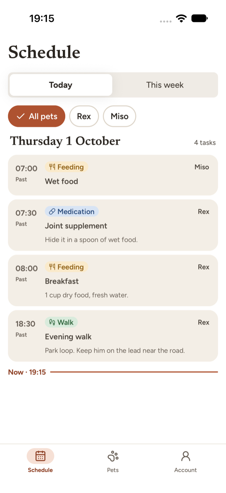
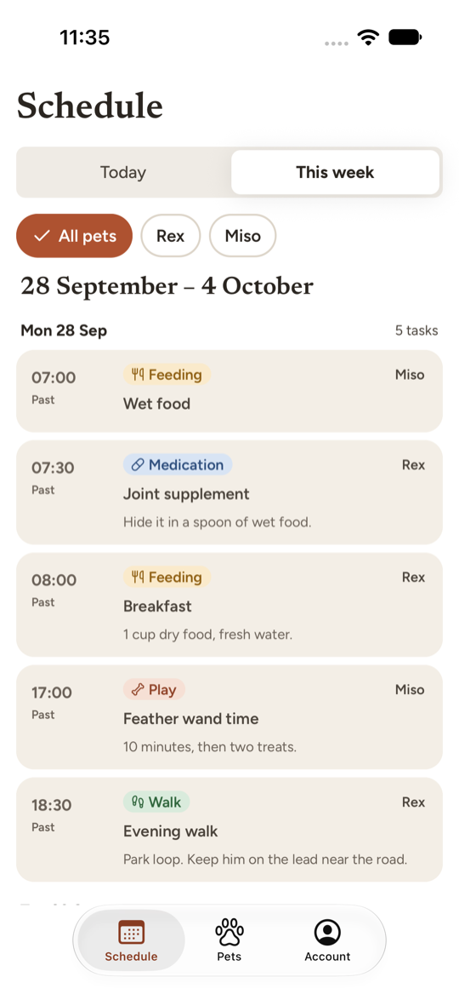
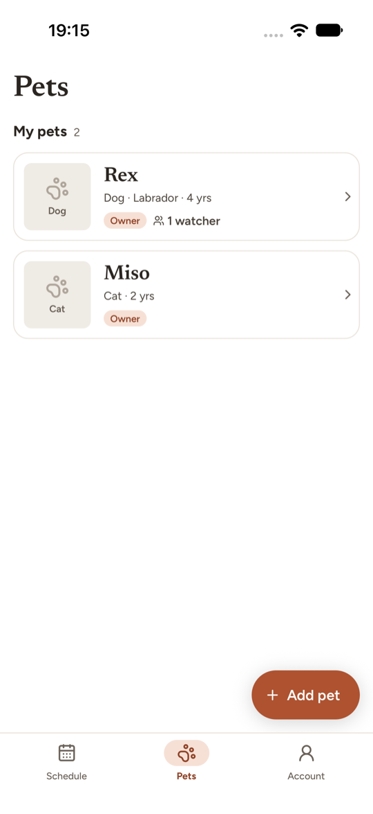
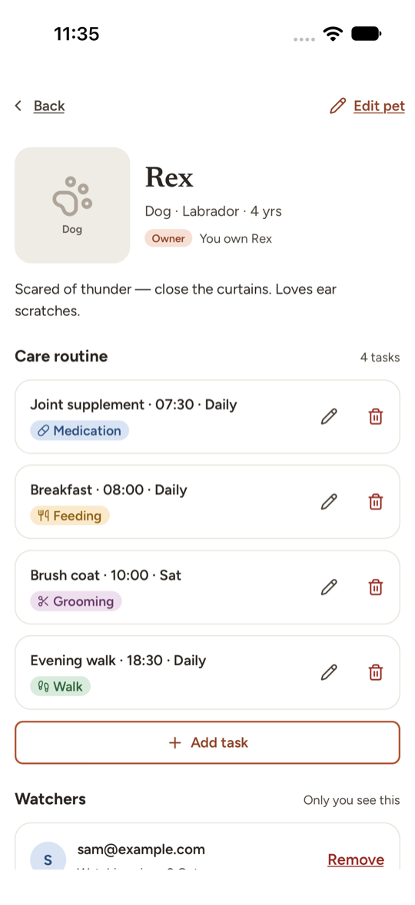
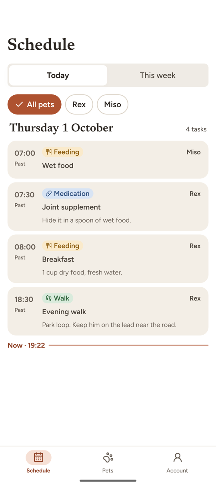
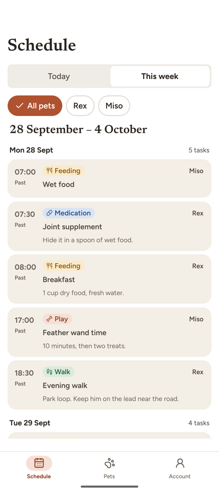
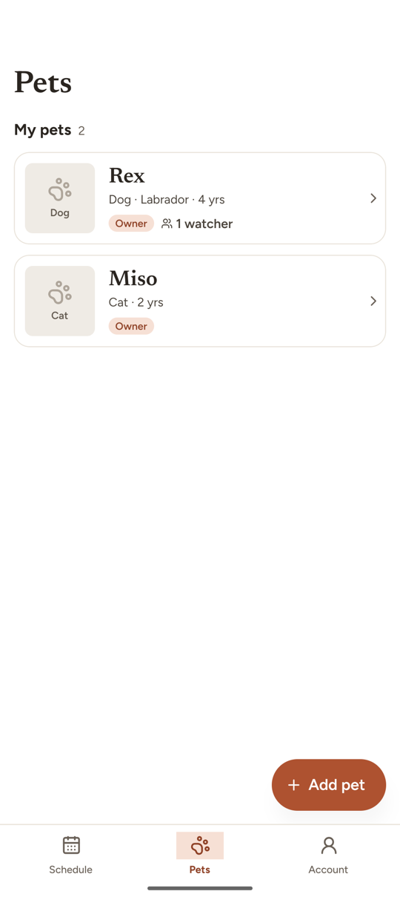
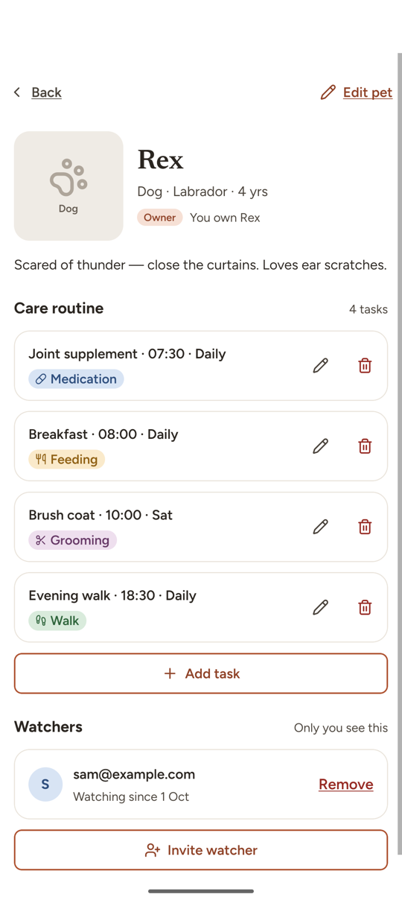

# PetWatch

Mobile app for pet owners who invite trusted people to look after their pets.
Expo (React Native) + NestJS + PostgreSQL, in one pnpm monorepo. Runs on iOS and Android.

| Today                                          | This week                                    | Pets                                         | Pet                                        |
| ---------------------------------------------- | -------------------------------------------- | -------------------------------------------- | ------------------------------------------ |
|      |      |      |      |
|  |  |  |  |

iOS 27 (top) and Android (bottom), demo data from `pnpm db:seed`. Every requirement from the brief, with
its status and where it lives, is in [`docs/REQUIREMENTS.md`](docs/REQUIREMENTS.md).

## Quick start

Prerequisites: Node 22+, pnpm 10 (`corepack enable`), Docker, and Xcode 27 (iOS) and/or Android Studio.

```bash
cp .env.example apps/api/.env      # API config (defaults match docker-compose); before install:
cp apps/mobile/.env.example apps/mobile/.env   # generating the Prisma client reads DATABASE_URL
pnpm install                       # installs everything, generates the Prisma client
pnpm db:up                         # Postgres :5432, SeaweedFS S3 :9000, Mailpit :8025
pnpm build:shared                  # compile the shared contract package
pnpm --filter @petwatch/api prisma:deploy   # apply committed migrations
pnpm dev:api                       # http://localhost:3000/health → {"status":"ok","db":"up"}

# in another terminal
pnpm db:seed                       # optional demo data (see below), needs the API running
pnpm --filter @petwatch/mobile ios # or: android. First run builds the dev client (minutes), then Metro
```

This is a **development build**, not Expo Go (the `petwatch://` scheme and the native modules need it).

**Android emulator:** forward the host ports once per emulator boot, so the default `localhost` URLs work:

```bash
adb reverse tcp:8081 tcp:8081 && adb reverse tcp:3000 tcp:3000 && adb reverse tcp:9000 tcp:9000
```

(Alternative: `EXPO_PUBLIC_API_URL=http://10.0.2.2:3000` in `apps/mobile/.env` and
`S3_PUBLIC_ENDPOINT=http://10.0.2.2:9000` in `apps/api/.env`.)

### Demo data

`pnpm db:seed` is opt-in and safe to re-run. It goes through the API, so hashing, access rules and the
invite flow are the real ones.

| Account (password `petwatch-demo`) | What you'll see                                             |
| ---------------------------------- | ----------------------------------------------------------- |
| `ana@example.com`                  | Owns Rex and Miso, both with care routines; Sam watches Rex |
| `sam@example.com`                  | Watches Rex: read-only pet and schedule                     |
| `lee@example.com`                  | Pending invite to Miso (open the link from Mailpit, :8025)  |

### Emails and deep links

Invite and password-reset emails land in Mailpit: http://localhost:8025. The links open the app:

```bash
xcrun simctl openurl booted "petwatch://invites/<token>"
adb shell am start -W -a android.intent.action.VIEW -d "petwatch://invites/<token>" com.petwatch.app
```

### Troubleshooting

- **API health says the database is down** ("trust authentication"): a local Postgres (e.g. Postgres.app)
  is listening on 5432 in front of Docker's. Stop it.
- **Android dev build stays blank on launch**: cold-boot the emulator (`emulator -avd <name> -no-snapshot-load`)
  and redo `adb reverse`.

## Running tests

```bash
pnpm typecheck && pnpm lint && pnpm test   # static checks + unit tests (no services needed)

# API e2e: real Postgres, Mailpit and S3 (docker compose), separate petwatch_test database
cp apps/api/.env.test.example apps/api/.env.test   # once
pnpm db:up
pnpm test:e2e            # creates petwatch_test if missing, migrate deploy, then test/*.e2e-spec.ts

# Mobile e2e: Maestro (curl -fsSL "https://get.maestro.mobile.dev" | bash) and `pnpm db:seed`;
# API + Metro + the dev build running on the device
pnpm e2e:mobile          # Android emulator: all 7 flows in apps/mobile/e2e/flows
pnpm e2e:mobile:ios      # iOS simulator: prepares it (no autocorrect / password AutoFill), 6 flows
```

API e2e tests truncate all tables before each test and clear the Mailpit inbox they read from, so don't keep
anything you care about there while they run. Maestro flows create their own users through the API, so they
need no reset. The offline flow is Android-only: the iOS simulator can't toggle airplane mode from a script.

**CI** (`.github/workflows/ci.yml`, every push to `main` and every PR): `format:check`, typecheck, lint, unit
tests, then the API e2e suite against the same `docker-compose.yml` services. Maestro runs locally only: it
needs a simulator with the dev build, which is slow and costly on CI for an MVP. The API suite includes an
access matrix (every pet route × owner / watcher / stranger / anonymous) that fails if a new pet route has no row.

## Repository layout

```
apps/api         NestJS 11 · Prisma 7 · PostgreSQL · JWT
apps/mobile      Expo SDK 57 · Expo Router · Gluestack UI v3 · TanStack Query · Jotai · RHF + Zod
packages/shared  Zod schemas + inferred types: the API contract used by both apps
docs/            REQUIREMENTS (traceability) · DECISIONS (why) · LEARNING (reading list) · design export
CLAUDE.md, apps/*/CLAUDE.md, .claude/   AI configuration used while building this
```

## Technical choices

Full reasoning with the rejected alternatives: [`docs/DECISIONS.md`](docs/DECISIONS.md) (D1–D56).

- **One contract, two apps.** Zod schemas in `packages/shared` validate API requests (`nestjs-zod`) _and_
  mobile forms (`zodResolver`). Types are inferred, never duplicated. Errors have one shape with stable codes.
- **Relationships, not roles.** Ownership is `pets.owner_id`; watching is a row in `pet_watchers`. Access is
  resolved per pet on the server; pets you can't see return 404, watchers trying to write get 403.
- **Schedules are rules.** A care task is "08:00 daily" or "18:00 Mon/Wed/Fri"; the Today and This week views
  are expanded from the rules on the device by one pure, tested function (D48).
- **Auth.** 15-minute JWT access token + opaque, hashed, rotating refresh token (revocable). The mobile client
  attaches tokens and refreshes once for concurrent 401s (single-flight). Reset and invite tokens are random,
  single-use, stored as SHA-256 hashes. Passwords use argon2id.
- **Invites are claims.** Accepting is a conditional update (pending, unexpired, invitee = me), so a link can't
  be used twice (D49). The owner sees sent / re-sent / already watching, and pending invites in the list.
- **Uploads go straight to S3** with a presigned PUT; the server picks the key and the API only stores it.
- **Mobile layering is lint-enforced**: screens → feature hooks (`queries.ts`) → presentational components →
  design system → Gluestack primitives. Server state only in TanStack Query; Jotai for view mode and filter.
- **Offline-aware**: a banner, cached data stays visible, and write buttons disable with a reason (D51).
- **iOS 27** needs the UIScene life cycle; a small config plugin adds it until Expo SDK 58 (D55).
- **Native UI where the OS does it better**: system tab bar via Expo Router native tabs (Liquid Glass on
  iOS, Material navigation on Android, D57); the system time picker, with times shown in the device's
  12/24-hour style (D58); keyboard handling through react-native-keyboard-controller, where form screens
  use `<Screen keyboardAware>` and "Next" walks the fields.

## What is stubbed and how to make it real

| Concern        | Local                          | Production                                                                                                                        |
| -------------- | ------------------------------ | --------------------------------------------------------------------------------------------------------------------------------- |
| Email          | Mailpit (real SMTP, web inbox) | Point `SMTP_*` at SES/Postmark/SendGrid SMTP, or swap the mail transport for the provider SDK                                     |
| Object storage | SeaweedFS (S3 API)             | Real S3: remove `S3_ENDPOINT`/`S3_PUBLIC_ENDPOINT`, use IAM role credentials, private bucket (+ CloudFront signed URLs if needed) |
| Deep links     | Custom scheme `petwatch://`    | Universal Links (iOS) / App Links (Android) on an https domain with a web fallback                                                |

## Assumptions

1. **"Added to their list" vs "invite email sent"**: the brief also says the invitee must click the link to be
   added. So an invite always sends an email; the feedback distinguishes sent / re-sent / already watching, and
   the owner's watcher list shows the invite as **Pending** until it's accepted.
2. **Unregistered invitee**: not supported by the brief, so the API returns a clear error. This reveals whether an
   email has an account; acceptable for an MVP because only a signed-in owner of a pet can ask.
3. **Age** is whole years, as specified.
4. **Timezone**: task times are wall-clock local time; owner and watcher are assumed to share a timezone.
5. **Week** = the Monday–Sunday week containing today.
6. **Only owners edit** pets and schedules; watchers read (the brief gives "view" to both, "edit" to owners).
7. **Declining an invite** isn't required: the invitee can ignore it; it expires after 7 days.
8. **A watcher leaving a pet** isn't required; only the owner removes watchers.

## Known limitations / with more time

- **Links use the custom scheme.** Many mail clients don't make `petwatch://` links clickable. Production would
  send https links handled by Universal Links / App Links, with a web fallback page.
- **Rate limits are in memory and on auth only** (D41): fine for one API instance; several instances need Redis.
  Invites aren't rate-limited, so an owner could probe which emails have accounts (assumption 2).
- **Age goes stale**: store `birthDate` instead.
- **Timezones**: store the owner's timezone with each task so watchers abroad see the right time.
- **More product**: push reminders for due tasks, a completion log ("fed at 08:05 by Ana"), watchers leaving a
  pet, declining invites.
- **Uploads**: a presigned POST with a size limit (today the app resizes before upload, the URL doesn't cap it).
- **Mobile e2e on CI**: run Maestro on an emulator in CI; locally the offline flow is Android-only.
- **Open iOS issue**: on the iOS 27 simulator, with the login password field focused, "Create an account"
  doesn't respond (Android is fine). Not yet diagnosed.
- **Visual QA** across devices, dark mode and the largest text size is still to do; the README screenshots
  predate the native tab bar.

## Working with AI

Built with Claude Code. Project rules for the assistant live in [`CLAUDE.md`](CLAUDE.md) plus one per app
([`apps/api/CLAUDE.md`](apps/api/CLAUDE.md), [`apps/mobile/CLAUDE.md`](apps/mobile/CLAUDE.md)); reusable prompts in
[`.claude/commands`](.claude/commands) (`/feature`, `/check`, `/review`, `/explain`). Every generated change was
reviewed, typechecked and tested; decisions are recorded in `docs/DECISIONS.md`.
